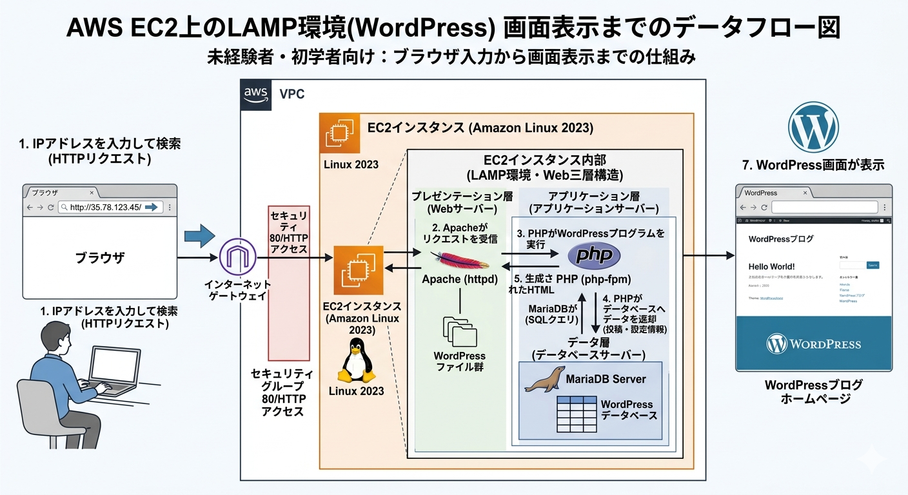

# 【Web三層構造-LAMP環境でWordPress利用】環境構築手順書

---

## 1. ドキュメント情報

| 項目 | 内容 |
|------|------|
| 手順書名 | Web三層構造-LAMP環境でWordPress利用（1台構成） |
| 作成日 | 2026-06-16 |
| 最終更新日 | 2026-06-16 |
| バージョン | v1.0 |
| 対象環境 | AWS |

> **改訂履歴**
>
> | バージョン | 日付 | 変更内容 |
> |-----------|------|---------|
> | v1.0 | 2026-06-16 | 初版作成 |

---

## 2. 目的・概要

### 2-1. 目的

> 本手順書では、AWSのEC2インスタンスを用いてWeb三層構造-LAMP環境の構築及びWordPress初期画面の表示の構築手順について説明する。
> 構築後はこの手順書を見ながら繰り返し環境構築を行うことで環境構築に慣れることを目指す。

### 2-2. 構成概要（アーキテクチャ）



1台のEC2インスタンス上にWebサーバ（Apache）、APサーバ（PHP）、DBサーバ（MariaDB）をすべて同居させる構成。

### 2-3. 完成イメージ（ゴール定義）

- EC2 インスタンスに SSH ログインできる
- ブラウザから `http://<パブリックIP>` にアクセスできる
- WordPressの初期設定画面が表示される

---

## 3. 前提条件・準備

### 3-1. 環境要件

| 項目 | 要件 |
|------|------|
| OS | AWS（Amazon Linux 2023）,WSL（Ubuntu 24.04） |
| インスタンスタイプ | t3.micro |
| Webサーバ | Apache |
| APサーバ | PHP |
| DBサーバ | MariaDB |
| Webサイト | WordPress |

### 3-2. 必要なアカウント・権限

- AWS アカウント
- SSH クライアントがローカルにインストール済みであること

### 3-3. 事前準備物

- キーペア（`.pem` ファイル）を作成・保存済み
- セキュリティグループを作成済み(以後、SGと呼称)

> **自分のグローバル IP 確認コマンド**
> ```bash
> curl ip-net.info
> ```

---

## 4. 構築手順（詳細）

> **注意事項**
> - コマンド中の `<山カッコ>` は自分の環境の値に置き換えること
> - `<任意の名前>` は、自分や他のメンバーと区別できるように決めること

---

### Step 1：セキュリティグループ（ファイアウォール）の設定

**目的：** ローカルPC（自分のPC）からAWSのEC2にSSHログイン及びHTTP接続するためのファイアウォールを設定する

#### 操作手順

1. AWS マネジメントコンソールにログインする
2. サービス検索バーで「EC2」と入力し、EC2 サービスを開く
3. 画面左上の三本線からサイドメニューを開く
4. 「セキュリティーグループ」をクリックする
5. 「セキュリティグループを作成」をクリックする
6. 以下の値を入力する(インバウンドルールは「ルールを追加」)

##### 基本的な詳細
| 設定項目 | 設定値 | 備考 |
|---------|--------|------|
| セキュリティグループ名 | `<任意の名前>_sg` | 任意の名前でよい |
| 説明 | `ローカルPCからのSSHログイン及びHTTP接続` | このセキュリティグループの説明 |

##### インバウンドルール
| タイプ | プロトコル | ポート範囲 | ソース | 説明 |
|-------|------------|----------|--------|------|
| SSH | TCP | 22 | マイIP | ローカルPCからSSHで接続 |
| HTTP | TCP | 80 | マイIP | ローカルPCのブラウザから接続 |

7. 「セキュリティグループを作成」をクリックする 

---

### Step 2：EC2インスタンスの起動

**目的：** LAMP環境とWordPressを導入するためのEC2インスタンスを作成する

#### 操作手順

1. AWS マネジメントコンソールにログインする
2. サービス検索バーで「EC2」と入力し、EC2 サービスを開く
3. 「インスタンスを起動」をクリックする
4. 以下の値を入力する

| 設定項目 | 設定値 | 備考 |
|---------|--------|------|
| 名前タグ | `<任意の名前>` | 任意の名前でよい |
| キーペア | `作成したキーペア` | 自分で作成したキーペアを選択 |
| SG | `自分で作成したSG` | 自分で作成したSGを選択 |

5. 「インスタンスを起動」をクリックする 

---

### Step 3：ローカルPCからEC2インスタンスにSSH接続

**目的：** EC2インスタンス内でサーバ構築をするための事前準備

#### 操作手順

```bash
# 作成したキーペアを用いてSSH接続
ssh -i <キーペアのファイルパス> ec2-user@<EC2のパブリックIPアドレス>

# 注意
# キーペアの権限を自分のみ読み込み可能にする
sudo chmod 400 <キーペアのファイルパス>

# キーペアの正しいファイルパスを指定する
  秘密鍵のファイルパスが以下の時
  ファイルパス：/home/ユーザー名/.ssh/privatekey.pem
  正）/home/ユーザー名/.ssh/privatekey.pem
  誤）/home/ユーザー名/privatekey.pem
```
---

### Step 4：Webサーバの構築

**目的：** EC2インスタンス内にApacheをインストールし、Webサーバの構築

#### 操作手順

```bash
# ソフトウェアパッケージのアップデート
sudo dnf update -y

# Apacheの最新バージョンをインストール
sudo dnf install -y httpd

# Apacheの起動
sudo systemctl start httpd

# Apacheの状態確認
sudo systemctl status httpd

# Apacheの自動起動設定
sudo systemctl enable httpd

# Apacheの自動起動設定の確認
sudo systemctl is-enabled httpd
```

**テスト：** 現段階でWebサーバが機能しているかテストします。
ブラウザでEC2インスタンスのパブリックIPアドレスを入力し、ブラウザ画面で **「IT WORKS!」** と表記されれば成功

---

### Step 5：APサーバの構築

**目的：** EC2インスタンス内にPHPをインストールし、APサーバを構築

#### 操作手順

```bash
# AL2023用のphpパッケージをインストール
sudo dnf install -y php php-mysqlnd

# phpパッケージの設定反映のため、Apacheを再起動
sudo systemctl restart httpd
```

**テスト：** APサーバとしてPHPをインストール後、WebサーバとAPサーバが連携し、機能しているかテストする。
```bash
# phpの詳細情報ページをapacheのドキュメントルートの配下に置く
# また、下記のコマンドどちらでも可能
echo "<?php phpinfo(); ?>" | sudo tee /var/www/html/phpinfo.php

sudo bash -c 'echo "<?php phpinfo(); ?>" > /var/www/html/phpinfo.php'
```

ブラウザで**「<EC2のパブリックIPアドレス>/phpinfo.php」**を検索
ブラウザにPHPの情報が表示されれば成功

作成したphpinfo.phpはセキュリティリスクのために削除しておく
`sudo rm /var/www/html/phpinfo.php`

---

### Step 6：DBサーバの構築

**目的：** EC2インスタンス内にMariaDBをインストールし、DBサーバの構築

#### 操作手順

```bash
# mariaDBソフトウェアパッケージのインストール
sudo dnf install -y mariadb105-server

# mariaDBサーバを起動
sudo systemctl start mariadb

# mariaDBの状態確認
sudo systemctl status mariadb

# mariaDBのセキュリティ初期設定
sudo mysql_secure_installation
```

対話形式の質問に以下のように回答する：
```
Enter current password for root (enter for none):
→ そのままEnter（初期パスワードなし）

Switch to unix_socket authentication [Y/n]:
→ n を入力してEnter

Change the root password? [Y/n]:
→ Y を入力してEnter
New password: （任意の強力なパスワードを入力）※メモしておくこと
Re-enter new password: （同じパスワードを再入力）

Remove anonymous users? [Y/n]:
→ Y を入力してEnter

Disallow root login remotely? [Y/n]:
→ Y を入力してEnter

Remove test database and access to it? [Y/n]:
→ Y を入力してEnter

Reload privilege tables now? [Y/n]:
→ Y を入力してEnter
```

```bash

# mariadbの自動起動設定
sudo systemctl enable mariadb

# mariadbの自動起動設定の確認
sudo systemctl is-enabled mariadb
```

---

### Step 7：WordPressの設定

**目的：** EC2インスタンス内にWordPressをインストールし、設定する

#### 操作手順

```bash
# URL指定でファイルをダウンロードするソフトをインストール
sudo dnf install -y wget

# WordPressインストールパッケージをダウンロード
wget https://wordpress.org/latest.tar.gz

# WordPressインストールパッケージを解凍
tar -xzf latest.tar.gz

# WordPress用データベースとユーザーをmariaDB上に作成
mysql -u root -p
```

```sql
-- データベースを作成
CREATE DATABASE <作成するデータベース名>;

-- ユーザーの作成
CREATE USER '<作成するユーザー名>'@'localhost' IDENTIFIED BY '<作成するユーザー名に対する任意のパスワード>';

-- 作成したデータベースに対する、全権限を作成したユーザーに付与
GRANT ALL PRIVILEGES ON <作成したデータベース名>.* TO '<作成したユーザー名>'@'localhost';

-- ここまでの変更を有効にする
FLUSH PRIVILEGES;

-- mariaDBからログアウト
exit
```

```bash
# WordPressの設定ファイルを作成
sudo cp wordpress/wp-config-sample.php wordpress/wp-config.php

# WordPressの設定ファイルを編集
sudo vi wordpress/wp-config.php

# 以下の変更前と変更後の内容を記載するので参考にして変更
# 作成したデータベース名、ユーザー名、パスワードを設定
define('DB_NAME','');
=> define('DB_NAME','<作成したデータベース名>');

define('DB_USER','');
=> define('DB_USER','<作成したユーザー名>');

define('DB_PASSWORD','');
=> define('DB_PASSWORD','<作成したパスワード>');

# WordPressのファイルをApacheがブラウザに表示できるように設定
sudo cp -r wordpress/* /var/www/html/

# WordPressのパーマリンク使用設定
sudo vi /etc/httpd/conf/httpd.conf

# <Directory "/var/www/html">セクション内の"AllowOverride None"を"AllowOverride All"に変更
AllowOverride None
=> AllowOverride All

# ApacheがWordPressファイルを読み書きできるように所有者を変更
sudo chown -R apache:apache /var/www/html/

# ApacheがWordPressファイルを読み書きできるように権限を変更
sudo chmod -R 755 /var/www/html/

# Apacheを再起動して、設定変更を有効化
sudo systemctl restart httpd

```

---

## 5. 動作確認・検証

> 構築完了後、以下の確認をすべてパスしたら構築成功とみなす。

### 5-1. 確認チェックリスト

- [ ] **確認①**：SSHログインできること
- [ ] **確認②**：WordPressの初期画面が表示されること

---

### 確認①：SSHログイン確認

```bash
# キーペアのパーミッション設定（初回のみ）
sudo chmod 400 <秘密鍵のファイルパス>

# SSH接続
ssh -i <秘密鍵のファイルパス> ec2-user@<EC2のパブリックIP>
```

**期待する結果：**

```
   ,     #_
   ~\_  ####_        Amazon Linux 2023
  ~~  \_#####\
  ~~     \###|       （ログインプロンプトが表示される）
  ~~       \#/ ___
   ~~       V~' '->
    ~~~         /
      ~~._.   _/
         _/ _/
       _/m/'
```

---

### 確認②：WordPressの初期画面表示

ブラウザで「http://<EC2のパブリックIPアドレス>」を検索し、WordPressの初期画面が表示されるか確認する

**期待する結果：** WordPressの言語設定を行う画面が表示される

---

## 6. トラブルシューティング

### よくあるエラーと対処法

---

#### エラー①：SSH 接続がタイムアウトする

**エラーメッセージ例：**

```
ssh: connect to host xx.xx.xx.xx port 22: Connection timed out
```

**原因：** セキュリティグループのインバウンドルールで SSH（ポート 22）が許可されていない可能性がある

**対処法：**

1. AWS コンソール → EC2 → セキュリティグループを開く
2. 対象のセキュリティグループのインバウンドルールを確認する
3. SSH（TCP/22）が自分の IP から許可されているか確認する
4. 許可されていなければ「インバウンドルールを編集」から追加する

---

#### エラー②：`Permission denied (publickey)` が出る

**エラーメッセージ例：**

```
ec2-user@xx.xx.xx.xx: Permission denied (publickey).
```

**原因：** キーペアが正しくないか、パーミッションが 400 になっていない

**対処法：**

```bash
# パーミッションを修正する
chmod 400 <your-key.pem>

# 正しいキーペアで接続し直す
ssh -i <正しいキーファイル.pem> ec2-user@<IP>
```

---

#### エラー③：（追加のエラー）

**エラーメッセージ例：** ～

**原因：** ～

**対処法：** ～

---

### ログの確認場所

| ログの種類 | 場所（パス） | 確認コマンド |
|-----------|------------|------------|
| OS システムログ | `/var/log/messages` | `sudo tail -f /var/log/messages` |
| Apache アクセスログ | `/var/log/httpd/access_log` | `sudo tail -f /var/log/httpd/access_log` |
| Apache エラーログ | `/var/log/httpd/error_log` | `sudo tail -f /var/log/httpd/error_log` |
| cloud-init ログ | `/var/log/cloud-init-output.log` | `cat /var/log/cloud-init-output.log` |

---

## 7. 参考リソース・関連資料

| 資料名 | URL / 場所 | 補足 |
|-------|-----------|------|
| AWS 公式：チュートリアル：AL2023にLAMPサーバーをインストールする | https://docs.aws.amazon.com/ja_jp/linux/al2023/ug/ec2-lamp-amazon-linux-2023.html | 環境構築の参考 |
| AWS 公式：チュートリアル：AL2023でWordPressブログをホストする | https://docs.aws.amazon.com/ja_jp/linux/al2023/ug/hosting-wordpress-aml-2023.html | 環境構築の参考 |
| 研修テキスト：Webサービス構築基礎 | 研修テキストP.81~P.99 | 環境構築における基本情報 |


---
## 付録（任意）

### A. 環境変数・パラメータまとめ

> 構築中に決定した値をここにまとめておくと、後から見返しやすい

| パラメータ名 | 自分の環境の値 | 説明 |
|------------|-------------|------|
| VPC CIDR | `デフォルト` | VPC のアドレス範囲 |
| パブリックサブネット CIDR | `デフォルト` | EC2 を置くサブネット |
| EC2 パブリック IP | `xx.xx.xx.xx` | SSH 接続先 |
| キーペア名 | `<秘密鍵の名前>` | SSH 認証に使用 |

### B. 削除・クリーンアップ手順

> 研修後にコストが発生しないよう、リソースの削除順序を記載しておく

1. EC2 インスタンスを終了する
2. セキュリティグループを削除する
3. サブネットを削除する
4. インターネットゲートウェイをデタッチ→削除する
5. VPC を削除する

> **注意：** 依存関係があるため、上記の順番を守ること。順番を間違えるとエラーになる。
