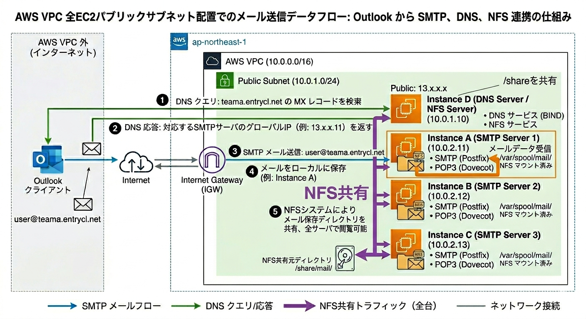

# 【Postfix + Dovecot + BIND + NFS を用いたメールサーバ構築(4台構成)】環境構築手順書

---

## 1. ドキュメント情報

| 項目 | 内容 |
|------|------|
| 手順書名 | Postfix + Dovecot + BIND + NFS を用いたメールサーバ構築(4台構成) |
| 作成日 | 2026-06-16 |
| 最終更新日 | 2026-06-16 |
| バージョン | v1.2 |
| 対象環境 | AWS |

> **改訂履歴**
>
> | バージョン | 日付 | 変更内容 |
> |-----------|------|---------|
> | v1.0 | 2026-04-21 | 初版作成 |
> | v1.1 | 2026-04-22 | 変更箇所の修正 |
> | v1.2 | 2026-06-16 | テンプレート構成に再構成、Step整合、誤記訂正 |

---

## 2. 目的・概要

### 2-1. 目的

> 本手順書では、DNSサーバ1台 + SMTPサーバ3台(ユーザー1〜3に対応)の合計4台構成で、NFSによるメールスプールの共有を行うメールシステムを構築する。
> 構築後は、ローカル環境のOutlookから送信したメールを、4台のサーバ全てで閲覧できる環境を目指す。

> **本手順書のスコープについて(重要)**
>
> 本手順書ではDNSサーバとして独自のBINDを構築するが、外部(Outlook等)からの名前解決を成立させるためには、**Route 53等の上位DNSでのサブドメイン権限委譲(NSレコード設定)** が本来必要となる。
> 本手順書ではRoute 53での権限委譲手順自体は省略しているが、`teama.entrycl.net` のように既に権限委譲済みのドメイン配下を利用する前提で記述している。

### 2-2. 構成概要(アーキテクチャ)



```
                [DNSサーバ (兼NFSサーバ)]
                  ├─ BIND
                  └─ NFS共有 (/share)
                       ↑ NFSマウント
        ┌──────────────┼──────────────┐
        ↓              ↓              ↓
  [SMTPサーバ1]   [SMTPサーバ2]   [SMTPサーバ3]
   Postfix         Postfix         Postfix
   Dovecot         Dovecot         Dovecot
   /var/spool/mail/ ← /shareをマウント
```

- **DNSサーバ**: BIND(名前解決) + NFSサーバ(`/share` を共有)
- **SMTPサーバ × 3台**: Postfix(SMTP) + Dovecot(POP3) + NFSクライアント(`/var/spool/mail/` にマウント)

### 2-3. 完成イメージ(ゴール定義)

- [ ] 各サーバから `/var/spool/mail/<ユーザー名>` 内を見たとき、メールが届いている
- [ ] 各サーバから telnet でホスト名を指定し、ユーザー名でログインしたとき、メールが届いている

---

## 3. 前提条件・準備

### 3-1. 環境要件

#### 3-1-1. DNSサーバ(兼NFSサーバ)

| 項目 | 要件 |
|------|------|
| OS | Amazon Linux 2023 |
| DNSサーバ | BIND |
| ファイル共有 | NFS |
| ツール | telnet |

#### 3-1-2. SMTPサーバ(3台共通)

| 項目 | 要件 |
|------|------|
| OS | Amazon Linux 2023 |
| SMTPサーバ | Postfix |
| POPサーバ | Dovecot |
| ソフトウェア | Mailx, Rsyslog |
| ツール | telnet |

### 3-2. 必要なアカウント・権限

- AWSアカウントを持っていること
- 4台のEC2が起動済みであること
- 各EC2にSSHログインできること

### 3-3. セキュリティグループ設定

#### 3-3-1. DNSサーバ(兼NFSサーバ)

| タイプ | プロトコル | ポート範囲 | ソース | 目的 |
|-------|-----------|-----------|--------|------|
| SSH | TCP | 22 | マイIP | ローカルからSSHログイン |
| DNS (UDP) | UDP | 53 | 0.0.0.0/0 | メールアドレスの名前解決でどこから届くか確定できないため |
| NFS | TCP | 2049 | 172.31.0.0/16 | 他3台とのファイル共有のため |

#### 3-3-2. SMTPサーバ(3台共通)

| タイプ | プロトコル | ポート範囲 | ソース | 目的 |
|-------|-----------|-----------|--------|------|
| SSH | TCP | 22 | マイIP | ローカルからSSHログイン |
| SMTP | TCP | 25 | 0.0.0.0/0 | どこからでもメール転送を受け入れるため |
| POP3 | TCP | 110 | 172.31.0.0/16 | 他3台とのファイル共有のため |

---

## 4. 構築手順(詳細)

> **注意事項**
> - コマンド中の `<山カッコ>` は自分の環境の値に置き換えること
> - `<任意の名前>` は、自分や他のメンバーと区別できるように決めること
> - 環境依存のパラメータ(IPアドレス等)は太字で明記する
> - エラーが出た場合は「6. トラブルシューティング」を参照

### 4-1. 環境構築の流れ

1. DNSサーバの構築 (Step 1)
2. NFSサーバの設定 (Step 2)
3. メールユーザーの作成 (Step 3)
4. SMTPサーバの構築 (Step 4)
5. POPサーバの構築 (Step 5)
6. NFSクライアントの設定(SMTPサーバ側) (Step 6)

---

### Step 1: DNSサーバの構築

**目的:** メールアドレスの名前解決を行うDNSサーバを構築する。**DNSサーバ上で実施**する。

#### 操作手順

```bash
# rootユーザーにスイッチ
sudo su -

# BINDをインストール
dnf install -y bind

# BINDの設定ファイルを編集
vi /etc/named.conf
```

設定ファイルの編集内容:

```
// ---以下のように変更---
// listen-on port 53 { 127.0.0.1; };       ← コメントアウト
// listen-on-v6 port 53 { ::1; };          ← コメントアウト
allow-query { any; };

// ---ファイル末尾に追記---
zone "teama.entrycl.net" IN {
    type master;
    file "/var/named/teama.entrycl.net.zone";
};
```

```bash
# 設定ファイルの構文チェック
named-checkconf

# 正引きゾーンデータベースファイルを新規作成
vi /var/named/teama.entrycl.net.zone
```

ゾーンファイルの編集内容:

```
$TTL 3600
@ IN SOA ns.teama.entrycl.net. test.gmail.com. (
    20260616 ; serial
    3600 ; refresh
    3600 ; retry
    3600 ; expire
    3600 ) ; minimum

    IN NS ns.teama.entrycl.net.
    IN MX 10 <ユーザー名1>.teama.entrycl.net.
    IN MX 10 <ユーザー名2>.teama.entrycl.net.
    IN MX 10 <ユーザー名3>.teama.entrycl.net.

ns           IN A <DNSサーバのグローバルIP>
<ユーザー名1>  IN A <SMTPサーバ1のグローバルIP>
<ユーザー名2>  IN A <SMTPサーバ2のグローバルIP>
<ユーザー名3>  IN A <SMTPサーバ3のグローバルIP>
```

> **補足:** Outlookなど外部からのメールはVPC外から問い合わせがくるため、グローバルIPを指定する必要がある。

```bash
# ゾーンファイルの構文チェック
named-checkzone teama.entrycl.net /var/named/teama.entrycl.net.zone

# BINDを起動
systemctl start named

# BINDの状態確認
systemctl status named

# BINDの自動起動設定
systemctl enable named
```

---

### Step 2: NFSサーバの設定(DNSサーバ上)

**目的:** メールスプールを4台で共有するためのNFS共有設定を行う。**DNSサーバ上で実施**する。

#### 操作手順

```bash
# 共有ディレクトリを作成
mkdir /share

# 共有ディレクトリを公開設定
vi /etc/exports
```

設定ファイルの編集内容:

```
# ---以下を追記---
/share 172.31.0.0/16(rw,no_root_squash)
# ----------------
```

```bash
# NFSサーバを起動し、自動起動設定を有効化
systemctl start nfs-server
systemctl enable nfs-server

# /shareディレクトリの所有グループを変更
chown -R root:mail /share

# /shareディレクトリの権限を変更
chmod 770 /share
```

#### 補足: /shareディレクトリの所有グループと権限変更の理由

- **所有グループの変更**:このあと「メールユーザー作成」で追加したユーザーを `mail` グループに所属させるので、その `mail` グループが `/share` を編集できるようにするため
- **権限変更(770)**:所有グループである `mail` グループに全権限を与えることで、`/share` 内に入り、ユーザーごとにメールを保存し、Dovecotでメールを閲覧できるようにする
  1. `r`(読み取り):Dovecotで `/share` 内のメールを閲覧(`ls`)
  2. `w`(書き込み):ユーザーごとにメールを保存
  3. `x`(実行):`/share` 内に入る(`cd`)

---

### Step 3: メールユーザーの作成

**目的:** メールサーバ専用の全員分のユーザーを **4台全サーバ** で作成する。

#### 操作手順

```bash
# 全SMTPサーバ + DNSサーバで、同じuid/gidのユーザーをサーバー台数分作成
useradd <任意のユーザー名> -u <UID> -g mail -M -K MAIL_DIR=/dev/null -s /sbin/nologin

# 「Creating mailbox file: Not a directory」と表示されれば成功
```

> **重要:** NFSで共有するため、**全サーバで同じUID/GID** にする必要がある。UIDがずれているとファイルの所有権が一致せず、別ユーザーのメールが見られなくなる。

---

### Step 4: SMTPサーバの構築

**目的:** メールを送受信するSMTPサーバを構築する。**3台のSMTPサーバそれぞれで実施**する。

#### 操作手順

```bash
# Postfixをインストール
dnf install -y postfix

# Postfixを起動
systemctl start postfix

# Mailxをインストール
dnf install -y mailx

# ログの有効化に必要なツールをインストール
dnf install -y rsyslog

# Rsyslogの起動
systemctl start rsyslog

# Postfixの設定ファイルのコメント行を削除し、複数空白行を1つにまとめて新しいファイルに保存
grep -v ^# /etc/postfix/main.cf | cat -s > /tmp/main.cf

# 設定ファイルを上書き
cp /tmp/main.cf /etc/postfix/main.cf
# → 「cp: overwrite '/etc/postfix/main.cf'?」と表示されるので「yes」と入力し、Enter

# 設定ファイルを編集
vi /etc/postfix/main.cf
```

設定ファイルの編集内容:

```
# ---以下を追記/変更---
myhostname = <作成したユーザー名>.teama.entrycl.net
mydomain = teama.entrycl.net
myorigin = $myhostname
inet_interfaces = all
mydestination = $mydomain, $myhostname
mynetworks = 172.31.0.0/16, 127.0.0.1
mail_spool_directory = /var/spool/mail/
# ---------------------
```

```bash
# Postfixを再起動
systemctl restart postfix
```

---

### Step 5: POPサーバの構築

**目的:** メールをダウンロードして閲覧するためのPOPサーバ(Dovecot)を構築する。**3台のSMTPサーバそれぞれで実施**する。

#### 操作手順

```bash
# Dovecotをインストール
dnf install -y dovecot

# telnetをインストール
dnf install -y telnet

# Dovecotの設定ファイルを編集
vi /etc/dovecot/dovecot.conf
```

設定ファイルの編集内容:

```
# ---以下を追記/変更---
protocols = pop3

# Maildir形式の設定。%uにはユーザ名が入る
mail_location = maildir:/var/spool/mail/%u/
# ---------------------
```

```bash
# SSL設定ファイルを編集 → sslをコメントアウト
vi /etc/dovecot/conf.d/10-ssl.conf
# 「#ssl = required」のように変更
```

```bash
# 認証設定ファイルを編集 → disable_plaintext_auth を no に
vi /etc/dovecot/conf.d/10-auth.conf
# 「disable_plaintext_auth = no」に変更
```

```bash
# Dovecotを起動
systemctl start dovecot

# Dovecotの自動起動設定
systemctl enable dovecot
```

---

### Step 6: NFSクライアントの設定(SMTPサーバ上)

**目的:** DNSサーバの共有ディレクトリ `/share` をSMTPサーバの `/var/spool/mail/` にマウントする。**3台のSMTPサーバそれぞれで実施**する。

#### 操作手順

```bash
# NFSの設定ファイルを編集
vi /etc/fstab
```

設定ファイルの編集内容:

```
# ---以下を追記---
<NFSサーバのプライベートIP>:/share /var/spool/mail/ nfs4 defaults 0 0
# ----------------
```

```bash
# /var/spool/mail/をマウント
mount /var/spool/mail/

# マウントできているか確認
df -h
```

**期待する結果:** `df -h` の出力に `<NFSサーバのプライベートIP>:/share` が `/var/spool/mail` にマウントされていることが表示される。

---

## 5. 動作確認・検証

> 構築完了後、以下の確認をすべてパスしたら構築成功とみなす。

### 5-1. 確認チェックリスト

- [ ] **確認①**: digコマンドでDNSの名前解決ができる
- [ ] **確認②**: telnetでPOPサーバに接続し、メールを閲覧できる

ホスト名は `<ユーザー名>.teama.entrycl.net`

---

### 確認①: DNS確認

```bash
# digコマンドでDNSの名前解決を確認
dig <ユーザー名>.teama.entrycl.net
```

**期待する結果:** zoneファイルで設定したIPが返ってくる。

---

### 確認②: POP確認

```bash
# telnetでPOPサーバに接続し、メールを閲覧できるか確認
telnet <自分のサーバのプライベートIP> 110
```

接続できたら、対話形式でログインしてメール確認:

```
user <作成したユーザー名>
pass <パスワード>
list
retr 1
quit
```

---

## 6. トラブルシューティング

### よくあるエラーと対処法

---

#### エラー①: SSH接続がタイムアウトする

**エラーメッセージ例:**
```
ssh: connect to host xx.xx.xx.xx port 22: Connection timed out
```

**原因:** セキュリティグループのインバウンドルールでSSH(ポート22)が許可されていない可能性がある

**対処法:**
1. AWSコンソール → EC2 → セキュリティグループを開く
2. 対象のセキュリティグループのインバウンドルールを確認する
3. SSH(TCP/22)が自分のIPから許可されているか確認する
4. 許可されていなければ「インバウンドルールを編集」から追加する

---

#### エラー②: `Permission denied (publickey)` が出る

**エラーメッセージ例:**
```
ec2-user@xx.xx.xx.xx: Permission denied (publickey).
```

**原因:** キーペアが正しくないか、パーミッションが400になっていない

**対処法:**
```bash
# パーミッションを修正する
chmod 400 <your-key.pem>

# 正しいキーペアで接続し直す
ssh -i <正しいキーファイル.pem> ec2-user@<IP>
```

---

#### エラー③: NFSマウントが失敗する

**エラーメッセージ例:**
```
mount.nfs4: Connection timed out
```

**原因:** NFSサーバ側のSGでNFS(TCP/2049)が許可されていない、`nfs-server` が起動していない、`/etc/exports` の設定ミス など

**対処法:**
```bash
# NFSサーバ側で /etc/exports の内容を反映
exportfs -ar

# NFSサーバ側でNFSが起動しているか確認
systemctl status nfs-server

# SMTPサーバ側で対象IPに接続できるか確認
ping <NFSサーバのプライベートIP>
```

---

#### エラー④: 別サーバから自分のメールが見られない

**原因:** メールユーザーのUID/GIDが各サーバで異なっている。NFS共有ファイルの所有権はUID/GIDで管理されるため、UIDがずれていると別ユーザー扱いになる。

**対処法:** Step 3で全サーバ共通のUID/GIDで作り直す。

```bash
# 各サーバで以下を実行し、UID/GIDを確認
id <作成したユーザー名>
```

---

### ログの確認場所

| ログの種類 | 場所(パス) | 確認コマンド |
|-----------|------------|------------|
| OSシステムログ | `/var/log/messages` | `sudo tail -f /var/log/messages` |
| メールログ | `/var/log/maillog` | `sudo tail -f /var/log/maillog` |
| BINDログ | `journalctl -u named` | `sudo journalctl -u named -f` |
| Dovecotログ | `journalctl -u dovecot` | `sudo journalctl -u dovecot -f` |
| NFSサーバログ | `journalctl -u nfs-server` | `sudo journalctl -u nfs-server -f` |

---

## 7. 参考リソース・関連資料

| 資料名 | URL / 場所 | 補足 |
|-------|-----------|------|
| Postfix 公式ドキュメント | https://www.postfix.org/documentation.html | Postfix設定リファレンス |
| Dovecot 公式ドキュメント | https://doc.dovecot.org/ | Dovecot設定リファレンス |
| BIND 公式ドキュメント (ISC) | https://www.isc.org/bind/ | BIND設定リファレンス |
| NFS 公式ドキュメント (Linux nfs-utils) | https://linux-nfs.org/ | NFS設定リファレンス |

---

## 付録(任意)

### A. 環境変数・パラメータまとめ

| パラメータ名 | 自分の環境の値 | 説明 |
|------------|-------------|------|
| DNSサーバ プライベートIP | `xx.xx.xx.xx` | NFSマウント先・DNS問い合わせ先 |
| DNSサーバ グローバルIP | `xx.xx.xx.xx` | ゾーンファイル ns Aレコード用 |
| SMTPサーバ1 プライベート/グローバルIP | `xx.xx.xx.xx` / `xx.xx.xx.xx` | ユーザー1用 |
| SMTPサーバ2 プライベート/グローバルIP | `xx.xx.xx.xx` / `xx.xx.xx.xx` | ユーザー2用 |
| SMTPサーバ3 プライベート/グローバルIP | `xx.xx.xx.xx` / `xx.xx.xx.xx` | ユーザー3用 |
| ドメイン名 | `teama.entrycl.net` | BINDで管理するゾーン名 |
| メールユーザー1〜3 | `<ユーザー名>` (UID統一) | 各SMTPサーバに対応 |

### B. 用語解説

| 用語 | 説明 |
|------|------|
| NFS | Network File System。サーバ間でディレクトリを共有するためのプロトコル(ポート2049)。 |
| MXレコード | あるドメイン宛のメールを受け取るメールサーバを示すDNSレコード。優先度の数字が小さいほど優先される。 |
| Maildir | メールを1メール1ファイル形式で保存する形式。 |
| no_root_squash | NFSクライアント側のrootユーザーを、サーバ側でもrootとして扱うNFSのオプション。 |

### C. 削除・クリーンアップ手順

1. SMTPサーバ側で `/etc/fstab` の追記行を削除し、`umount /var/spool/mail/` を実行
2. EC2インスタンスを4台とも終了する
3. セキュリティグループを削除する
4. キーペアを削除する(必要に応じて)

> **注意:** NFSマウント中のままEC2を終了するとマウントが残った状態になる可能性があるため、先にアンマウントすることを推奨。
